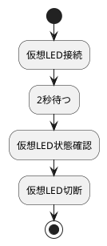
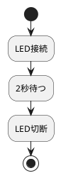
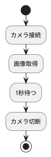
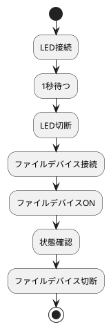

# USB機器や特定環境に依存しない学習ロードマップ

## 前提

USB接続制御アダプタや特定実機に依存せず、PC環境だけで以下のような構成を設計できるようになることを目標にします。

```text
PlantUML風シナリオ
  -> 変換
  -> Orchestrator
  -> Adapter
  -> Controller
```

ただし、実機USB制御ではなく、以下のような **仮想デバイス・PC内リソース・USBカメラ** を使って練習します。

```text
使うもの：
- PC上のファイル
- メモリ上の仮想デバイス
- ローカルHTTPサーバ
- USBカメラ 任意
- FakeSerial / FakeDevice
```

---

# 0. 現状ステータス（2026-08-17 時点）

## 実装状況

Phase1〜4（仮想LED・Fakeベースの基礎練習）を飛ばして、Phase5・6・8相当（Orchestrator/設定駆動パイプライン/USBカメラ）に先行着手した状態から、Step0〜Step5まで完了しました。詳細な経緯は[01_docs/decisions/](decisions/)を参照してください。

```text
実装済み:
- adapter_core.baseadapter.BaseAdapter (adapters/core/)
    独立ワークスペースパッケージとして切り出し済み。execute_stepはasync（Step5）
- orchestrator.orchestrator.Orchestrator / GenericOrchestrator (orchestrator/src/orchestrator/)
    Orchestrator: CameraAdapterを使った具体的なOrchestrator（sync、デモ用のまま）
    GenericOrchestrator: workflow.yamlからパイプラインを読み込み、動的importで実行する汎用版
    execute_pipelineはasync（setup/teardownはsyncのまま、execute_stepだけawait）
- CameraAdapter / CameraController (adapters/usb_camera_adapter/)
    OpenCVベースの実カメラ制御、ROIによるLED点灯判定。config/camera_controller両対応の初期化
    execute_stepはasync、OpenCV呼び出しはasyncio.to_threadで分離
- CameraMockController (adapters/usb_camera_adapter/tests/test_support/)
    Fakeによるテスト用実装
- normalizer.converter (normalizer/src/normalizer/)
    PlantUML風テキスト -> workflow.yaml相当のlist[dict]へ変換する純粋関数convert()
    変換ルール（lifecycle_labels/action_mapping）はconfig/mapping.yamlに外出し、load_mapping()で読込
    ファイルI/Oは一切行わない（convert()はテキスト受け取りdict列を返すだけ）
- normalizer/config/workflow.yaml
    パイプライン定義のYAML（adapter/action/params）。今のところ1ステップのみ、まだ手書き
    （converter.pyの出力をここに書き出す/直接渡す配線はまだ未実装、[08](decisions/08_plantuml_conversion_design_policy.md)未確定事項2）
- normalizer/config/mapping.yaml
    PlantUMLラベル -> adapter/action/paramsの変換ルール定義
- テスト（pytest -m "not hardware" で 21 passed, 2 deselected）
    orchestrator/tests/test_orchestrator.py（Mock使用）
    orchestrator/tests/test_generic_orchestrator.py（Fake使用、非同期化対応済み）
    adapters/usb_camera_adapter/tests/test_camera_adapter.py（Fake使用）
    normalizer/tests/test_converter.py（convert()は自前ルールで、load_mapping()は実mapping.yamlで検証）
    integrationtest/（実機必要分は@pytest.mark.hardwareで分離）
- orchestrator/main.py（実機での一連の動作を確認済み、exit code 0）
- Git/GitHub運用
    ルート（本リポジトリ）: https://github.com/tygff422/scenario_test （push済み）
    adapters/usb_camera_adapter: 別GitHubリポジトリ https://github.com/tygff422/UsbCameraController で独立管理
    （そちらへの直近実装分の反映はまだ未push）
- フォルダ構成の棚卸し・整理（.python-version統一、不要main.py/egg-info削除等、
  [07_folder_structure_cleanup.md](decisions/07_folder_structure_cleanup.md)）

未着手:
- Phase1, 2, 4（仮想LED, Fake中心の基礎練習）
- Phase6の残り：converter.pyの出力を実際にworkflow.yamlへ書き出す/GenericOrchestratorに
  直接渡す「実行スクリプト」部分（[08](decisions/08_plantuml_conversion_design_policy.md)未確定事項2）
- Phase7（ファイルController, ローカルHTTP Controller, FakeSerial）
- Phase9（registry.py, context.py, 総合演習としての最終統合）
```

## 緊急修正8件

✅ **全件完了**。詳細と経緯は[01_docs/decisions/04_urgent_fix_camera_pipeline.md](decisions/04_urgent_fix_camera_pipeline.md)を参照。

## ロードマップの進捗

```text
Step 0  緊急修正（8件）                          ✅ 完了
Step 1  Fakeベースのユニットテストで固定           ✅ 完了
         - CameraMockControllerを使ったAdapter単体テスト3件全てPASSED
         - test_adapter_enter_exit を修正（Fakeのled_status未設定を解消）
         - integrationtest/ に @pytest.mark.hardware を導入し、実機依存テストを分離
           （pytest -m "not hardware" で実機不要テストのみ実行可能）
Step 2  GenericOrchestrator の E2E テスト          ✅ 完了
         - orchestrator/tests/orchestrator_test_support/fake_pipeline_adapter.py に
           BaseAdapter実装のFakeを追加し、test_generic_orchestrator.py で
           動的import→setup→execute_step→teardownおよび各失敗パターンを検証（7件PASS）
         - 副次的に発見: usb_camera_adapter側と同名の`test_support`パッケージを作ると、
           両方のtests/を1回のpytest実行にまとめた際にモジュール名衝突が起きるため、
           `orchestrator_test_support`という個別名に変更して回避（詳細はorchestrator/README.md）
Step 3  ドキュメント整理（資料まとめ・更新）        ✅ 完了
         - 01_docs/decisions/ を作成し、01_, 02_... で設計判断を記録（運用中）
         - orchestrator/README.md を記入完了
Step 4  インターフェース健全化                     ✅ 完了
         - interfaces.py のシグネチャを実装に合わせて修正済み
         - CameraAdapter が config / camera_controller 両対応に統一済み
Step 5  非同期化（学習計画Phase4/7相当）           ✅ 完了
         - 学習計画14-4の方針通り、境界は`execute_step`のみ
           （`GenericOrchestrator.execute_pipeline`と`BaseAdapter.execute_step`をasync化、
           `setup`/`teardown`はsyncのまま）
         - `CameraAdapter.execute_step`はOpenCVのブロッキング呼び出しを
           `asyncio.to_thread`で分離
         - デモ用`Orchestrator`（CameraAdapter固定クラス）は対象外のまま維持（方針として決定）
         - 詳細は[09_async_execute_step.md](decisions/09_async_execute_step.md)参照
Step 6  PlantUML -> DSL 変換（学習計画Phase6相当） 🔶 進行中
         - normalizer/converter.py: convert(plantuml_text, lifecycle_labels, action_mapping)
           を純粋関数として実装（ファイルI/O無し）
         - 変換ルールはnormalizer/config/mapping.yamlに外出し、load_mapping()で読込
         - 残り：converter.pyの出力を実際にworkflow.yaml書き出し/実行まで繋ぐ配線
         - 詳細は[08_plantuml_conversion_design_policy.md](decisions/08_plantuml_conversion_design_policy.md)参照
Step 7  最終統合・リファクタリング（学習計画Phase9相当） ⬜ 未着手
```

## ロードマップ外で追加的に決定・実施した事項

作業中に発見し、都度判断して完了させたもの：

- `BaseAdapter`を`adapter-core`という独立ワークスペースパッケージへ切り出し（[03](decisions/03_package_settings_adapter_orchestrator.md)）
- `orchestrator`のimport規約統一（`packages=["src"]` → `["src/orchestrator"]`、[03](decisions/03_package_settings_adapter_orchestrator.md)）
- `test_support`を`src/`から`tests/`へ移動（配布境界の是正、[03](decisions/03_package_settings_adapter_orchestrator.md)）
- `orchestrator/main.py`の壊れたimportを短い形式へ修正、実機で動作確認（[04](decisions/04_urgent_fix_camera_pipeline.md)）
- `img/`フォルダ誤生成の原因究明と修正（テスト副作用防止・パス堅牢化・`.gitignore`追加、[03](decisions/03_package_settings_adapter_orchestrator.md)）
- ドキュメント構成の確定（`doc` → `docs` → `01_docs`、`decisions/`のNN命名・ADR形式運用ルール確立）
- 権限運用の整備（CLAUDE.md更新＋`.claude/settings.json`作成、[05](decisions/05_permission_prompt_reduction.md)）
- `workflow.yaml`の使い方・パラメータの渡り方をガイド化（[06](decisions/06_workflow_yaml_usage.md)）
- フォルダ構成全体の棚卸しと6件の掃除（[07](decisions/07_folder_structure_cleanup.md)）
- ルートリポジトリのGit初期化・GitHub連携（`https://github.com/tygff422/scenario_test`）
- PlantUML変換（Step6）の設計方針決定（[08](decisions/08_plantuml_conversion_design_policy.md)）

## 現時点で残っている未完了タスク

（2026-08-17時点で更新）

1. Step6の残り：`converter.py`の出力を実際に実行まで繋ぐ配線（[08](decisions/08_plantuml_conversion_design_policy.md)未確定事項2） ← 次はこれ
2. Step7：`registry.py`/`context.py`等の最終統合、同一Adapterインスタンスを複数アクションで
   使い回す仕組み（[06](decisions/06_workflow_yaml_usage.md)の既知の制約）
3. `adapters/usb_camera_adapter`（別GitHubリポジトリ）側に、直近のsrc/tests実装がまだpushされていない

---

# 1. 学習方針

今回の目的は、USB機器を動かすことではなく、

```text
複雑な処理を階層分離して設計する力
```

を身につけることです。

そのため、実機の代わりに次のような題材を使います。

---

## 実機依存を避けた題材

| 題材 | 実機依存 | 学べること |
|---|---:|---|
| 仮想LED | なし | Adapter/Controller分離 |
| ファイル操作 | なし | 状態管理、cleanup |
| ローカルHTTP API | なし | 外部I/O、失敗処理 |
| FakeSerial | なし | シリアル風通信 |
| USBカメラ | 低い | 実デバイスI/O、画像取得 |
| タイマー/待機 | なし | async/await |
| mock/fake | なし | テスト設計 |

---

# 2. 最終的に作るもの

最終成果物は、こういう小さなシナリオ実行フレームワークです。



これを、

```text
PlantUML風テキスト
  -> IR
  -> MiniOrchestrator
  -> LedAdapter
  -> LedController
```

で実行します。

---

# 3. 全体ロードマップ

おすすめの順番はこれです。

```text
Phase 1: Python設計基礎
Phase 2: Adapter / Controller分離
Phase 3: pytest / Fake / Mock
Phase 4: async / threading / to_thread
Phase 5: MiniOrchestrator作成
Phase 6: PlantUML風DSL変換
Phase 7: ローカル外部I/O練習
Phase 8: USBカメラ任意課題
Phase 9: 総合演習
```

---

# 4. Phase 1：Python設計基礎

目安：1-2週間

## 学ぶこと

```text
- class
- Enum
- dataclass
- 型ヒント
- try/except
- raise
- logging / loguru
- pathlib
```

---

## 練習題材：仮想LED

実機の代わりに、メモリ上の状態だけを持つ仮想LEDを作ります。

```python
class LedController:
    def __init__(self):
        self.connected = False
        self.powered = False

    def open(self) -> bool:
        self.connected = True
        return True

    def close(self) -> bool:
        self.connected = False
        return True

    def power_on(self) -> bool:
        if not self.connected:
            return False
        self.powered = True
        return True

    def power_off(self) -> bool:
        if not self.connected:
            return False
        self.powered = False
        return True

    def status(self) -> str:
        return "PW=1" if self.powered else "PW=0"
```

---

## 到達目標

以下を自分で説明できること。

```text
open() と power_on() の違い
close() と power_off() の違い
status() が必要な理由
```

---

# 5. Phase 2：Adapter / Controller分離

目安：2-3週間

## 学ぶこと

```text
- Controllerは実動作
- AdapterはOrchestratorとの橋渡し
- Adapterは複数Controller関数を組み合わせる
- cleanup / disconnect の責務差
```

---

## 作るもの

```text
LedController
  - open()
  - close()
  - power_on()
  - power_off()
  - status()

LedAdapter
  - connect()
  - disconnect()
  - is_ready()
  - cleanup()
  - execute()
```

---

## 責務イメージ

```text
Controller:
  実際の処理を1つずつ行う

Adapter:
  connect = open + power_on + is_ready
  disconnect = power_off + close
  cleanup = closeのみ
  execute = Orchestratorからの命令受付
```

---

## 練習シナリオ

```python
adapter.connect()
assert adapter.is_ready() is True
adapter.disconnect()
```

---

# 6. Phase 3：pytest / Fake / Mock

目安：2〜4週間

## 学ぶこと

```text
- pytest
- fixture
- MagicMock
- Fakeクラス
- 正常系
- 異常系
- 呼び出し履歴
- 状態遷移テスト
```

---

## 実機なしで学ぶ中心

ここでは本番Controllerの代わりに `FakeController` を作ります。

```python
class FakeLedController:
    def __init__(
        self,
        open_success=True,
        power_on_success=True,
        status_response="PW=1",
    ):
        self.open_success = open_success
        self.power_on_success = power_on_success
        self.status_response = status_response
        self.connected = False

    def open(self):
        if self.open_success:
            self.connected = True
        return self.open_success

    def power_on(self):
        return self.power_on_success

    def status(self):
        return self.status_response
```

---

## テスト観点

```text
connect成功
open失敗
power_on失敗
statusがPW=0
未対応命令
cleanupでcloseされる
disconnectでpower_offとcloseされる
```

---

# 7. Phase 4：async / threading / to_thread

目安：2〜3週間

## 学ぶこと

```text
- async def
- await
- asyncio.sleep
- asyncio.to_thread
- asyncio.create_task
- asyncio.wait_for
- イベントループ
- ブロッキング処理
```

---

## 実機なしの練習

時間のかかる同期処理を作ります。

```python
import time

def blocking_connect():
    time.sleep(3)
    return True
```

これを async から直接呼ぶ場合と、`to_thread` で呼ぶ場合を比較します。

```python
async def execute_direct():
    return blocking_connect()


async def execute_thread():
    return await asyncio.to_thread(blocking_connect)
```

---

## 理解すること

```text
直接呼び出し:
  自分も待つ。他のasync処理も止める。

to_thread:
  自分は待つ。他のasync処理は止めない。
```

---

## Adapterへの反映

```python
async def execute(self, action: str) -> bool:
    result = await asyncio.to_thread(self._execute_impl, action)

    if result:
        return True

    raise RuntimeError(f"Action failed: {action}")
```

---

# 8. Phase 5：MiniOrchestrator作成

目安：3〜4週間

## 学ぶこと

```text
- Step
- Context
- Registry
- run loop
- action
- sleep
- error handling
- timeout
```

---

## Step定義

```python
from dataclasses import dataclass

@dataclass
class Step:
    id: str
    op: str
    value: dict
    next: str | None = None
```

---

## 簡易Orchestrator

```python
class MiniOrchestrator:
    def __init__(self, registry):
        self.registry = registry

    async def run(self, steps):
        pc = "start"

        while pc is not None:
            step = steps[pc]

            if step.op == "action":
                adapter_name = step.value["adapter"]
                method = step.value["method"]
                adapter = self.registry[adapter_name]
                await adapter.execute(method)
                pc = step.next

            elif step.op == "sleep":
                sec = step.value["seconds"]
                await asyncio.sleep(sec)
                pc = step.next

            elif step.op == "stop":
                pc = None
```

---

## 到達目標

以下を理解できること。

```text
OrchestratorはAdapterの中身を知らない
Orchestratorはadapter.execute()だけ呼ぶ
AdapterがControllerを知っている
```

---

# 9. Phase 6：PlantUML風DSL変換

目安：3〜4週間

## 学ぶこと

```text
- DSL
- テキスト解析
- 正規化
- IR
- mapping
```

---

## 最初はPlantUML完全対応しなくてよい

まずはこの程度で十分です。



---

## 変換ルール

```python
mapping = {
    "LED接続": {"op": "action", "adapter": "LED", "method": "CONNECT"},
    "LED切断": {"op": "action", "adapter": "LED", "method": "DISCONNECT"},
}
```

```text
:2秒待つ;
  -> {"op": "sleep", "seconds": 2}
```

---

## 到達目標

以下を作る。

```text
PlantUML風テキスト
  -> list[Step] または dict[str, Step]
```

---

# 10. Phase 7：ローカル外部I/O練習

目安：2〜4週間

ここから少し実践寄りにします。
ただし、まだUSB専用機器は使いません。

---

## 題材A：ファイルController

PC上のファイルを仮想デバイス状態として扱います。

```text
device_state.txt

ON
OFF
```

Controller：

```text
open()
power_on()  -> ファイルに ON と書く
power_off() -> ファイルに OFF と書く
status()    -> ファイルを読む
close()
```

学べること：

```text
- ファイルI/O
- cleanup
- 状態永続化
- 異常系
```

---

## 題材B：ローカルHTTP Controller

FastAPIや標準ライブラリでローカルサーバを立てます。

```text
POST /power/on
POST /power/off
GET /status
```

AdapterからHTTP経由で操作します。

学べること：

```text
- 外部API
- timeout
- 接続失敗
- retry
- Adapter/Controller分離
```

---

## 題材C：FakeSerial

pyserialなしでも、シリアル風の流れを再現します。

```python
class FakeSerial:
    def __init__(self):
        self.is_open = True
        self.last_cmd = None

    def write(self, data):
        self.last_cmd = data

    def readline(self):
        if self.last_cmd == b"PW?\n":
            return b"PW=1\n"
        return b"OK\n"

    def close(self):
        self.is_open = False
```

学べること：

```text
- serial.Serial風の設計
- write/readline
- is_open
- close
- timeout相当の考え方
```

---

# 11. Phase 8：USBカメラ任意課題

目安：任意 2〜4週間

USBカメラが使えるなら、ここで実デバイスI/Oを少し扱えます。
ただし、USB接続制御アダプタとは違い、カメラは比較的扱いやすいです。

---

## 学ぶこと

```text
- OpenCV
- カメラopen
- frame取得
- release
- is_ready
- cleanup
```

---

## CameraController

```text
open_camera()
capture_frame()
close_camera()
is_open()
```

---

## CameraAdapter

```text
connect()
  -> open_camera
  -> is_ready

capture()
  -> capture_frame

disconnect()
  -> close_camera

cleanup()
  -> close_camera
```

---

## シナリオ例



---

## 注意

USBカメラ課題は任意です。

理由：

```text
環境差がある
OpenCVインストールが必要
カメラ使用中だと失敗する
テスト自動化しにくい
```

設計学習だけなら、FakeCameraで十分です。

---

# 12. Phase 9：総合演習

目安：4〜6週間

最終的に、以下を作ります。

```text
MiniScenarioFramework/
  normalizer.py
  converter.py
  orchestrator.py
  registry.py
  context.py
  adapters/
    led_adapter.py
    file_adapter.py
    camera_adapter.py  任意
  controllers/
    led_controller.py
    file_controller.py
    camera_controller.py  任意
  tests/
    test_led_flow.py
    test_file_flow.py
    test_error_flow.py
```

---

## 最終シナリオ



---

# 13. 12週間学習プラン

## Week 1：Python基礎復習

```text
class
Enum
dataclass
try/except
logger
```

成果物：

```text
LedController
```

---

## Week 2：Adapter/Controller分離

```text
LedAdapter
connect/disconnect/is_ready/cleanup
```

成果物：

```text
LedAdapter + LedController
```

---

## Week 3：pytest正常系

```text
connect成功
disconnect成功
is_ready成功
cleanup成功
```

成果物：

```text
test_led_adapter_success.py
```

---

## Week 4：pytest異常系

```text
open失敗
power_on失敗
status PW=0
未対応命令
```

成果物：

```text
test_led_adapter_error.py
```

---

## Week 5：async/to_thread

```text
execute async化
blocking処理比較
heartbeat実験
```

成果物：

```text
AsyncLedAdapter
```

---

## Week 6：MiniOrchestrator

```text
Step
Registry
action
sleep
run
```

成果物：

```text
MiniOrchestrator
```

---

## Week 7：PlantUML風変換

```text
:LED接続;
:2秒待つ;
:LED切断;
```

成果物：

```text
converter.py
```

---

## Week 8：統合テスト

```text
PlantUML風DSL
-> converter
-> orchestrator
-> adapter
-> controller
```

成果物：

```text
test_full_flow.py
```

---

## Week 9：ファイルController

```text
ファイルにON/OFF保存
状態確認
cleanup
```

成果物：

```text
FileDeviceAdapter
```

---

## Week 10：HTTP Controller または FakeSerial

どちらか選択。

おすすめは最初は FakeSerial。

```text
write/readline/close/is_open
```

成果物：

```text
FakeSerialController
```

---

## Week 11：異常系強化

```text
timeout
例外
未対応命令
retry風処理
```

成果物：

```text
error scenario tests
```

---

## Week 12：リファクタリング

```text
責務整理
ログ整理
テスト整理
README作成
```

成果物：

```text
MiniScenarioFramework完成
```

---

# 14. 重要な設計練習テーマ

実機なしでも、以下は十分学べます。

---

## 1. connect と cleanup の違い

```text
connect:
  使える状態にする

disconnect:
  明示的に終了する

cleanup:
  リソースを片付ける
```

---

## 2. Adapter と Controller の違い

```text
Controller:
  1つ1つの具体操作

Adapter:
  上位命令を受け取り、Controller操作を組み合わせる
```

---

## 3. execute の役割

```text
execute:
  Orchestratorから呼ばれる入口
  action文字列をEnum化
  対応する関数を呼ぶ
  成功/失敗を上位へ伝える
```

---

## 4. async と sync の境界

```text
Orchestrator:
  async

Adapter.execute:
  async

Adapter.connect/disconnect:
  sync

Controller:
  sync

境界:
  asyncio.to_thread
```

---

## 5. FakeとMockの使い分け

```text
Fake:
  状態遷移を再現したい

Mock:
  呼ばれたことを確認したい

MagicMock:
  簡単に置き換えたい

FakeSerial:
  本番に近い流れを再現したい
```

---

# 15. USBカメラを使う場合の位置づけ

USBカメラは、メイン教材ではなく **応用課題** にするのが良いです。

理由：

```text
環境差がある
OpenCVが必要
他アプリがカメラ使用中だと失敗する
テスト自動化しにくい
```

ただし、学べることはあります。

```text
open
read
release
is_ready
cleanup
実デバイスI/O
```

なので、基礎ができた後に、

```text
FakeCamera -> RealCamera
```

の順で進むのがおすすめです。

---

# 16. 最初に作るべき最小課題

まずはこれだけで良いです。

```text
PlantUML風DSLはまだ作らない
Orchestratorもまだ作らない

最初は：
LedController
LedAdapter
pytest
```

最小コード構成：

```text
mini_project/
  led_controller.py
  led_adapter.py
  tests/
    test_led_adapter.py
```

---

## 最初のゴール

```python
adapter = LedAdapter(LedController())

assert adapter.connect() is True
assert adapter.is_ready() is True
assert adapter.disconnect() is True
```

次に、

```python
result = await adapter.execute("CONNECT")
```

を作る。

その後にOrchestratorへ進む。

---

# 17. 最終まとめ

USB機器に依存せずに学ぶなら、以下の順番が最適です。

```text
1. 仮想LED
2. FakeController
3. pytest
4. async execute + to_thread
5. MiniOrchestrator
6. PlantUML風変換
7. ファイルController
8. FakeSerial
9. USBカメラ 任意
10. 総合演習
```

この順番なら、実機がなくても、

```text
PlantUML -> 変換 -> Orchestrator -> Adapter -> Controller
```

の設計思想を十分に身につけられます。
