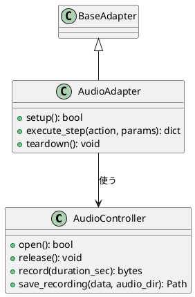

# 新しいAdapterパッケージを追加するガイド

新しいデバイス種別（例：Audio、File、HTTP等）をこのフレームワークに追加する時の手順をまとめたもの。`usb_camera_adapter`（CameraAdapter/CameraController）を作った時の型をなぞる形になっている。

このガイドは「今どうすればいいか」を示す生きた文書。各ステップの詳しい経緯・理由は`decisions/`内の該当ドキュメントにリンクしている。

## 正式な流れ（2026-08-27改訂）

```text
要件定義 → 設計・クラス図作成 → 1つずつ実装 → テスト
```

以前は「1. 新パッケージを作る」から始まる8ステップの実装手順だけを並べていたが、**実装に入る前に要件定義とクラス図を作る**流れに改めた。理由：実装内容の設計意図を利用者が自分の言葉で説明できるレベルで理解する、という目的（CLAUDE.md「実装作業の説明順序」）に対して、口頭の説明だけでなく**書面の設計成果物**として残す方が定着しやすいため。

## 記録先

新しい機能ごとに`01_docs/decisions/`へ新規番号でファイルを作り、以下の4つの見出しを必ず立てる。

```text
01_docs/decisions/NN_<name>.md
  ## 要件定義
  ## 設計・クラス図
  ## 実装
  ## テスト
```

**フォルダを4つ（要件定義/・設計/・実装/・テスト/）に分けるのは避ける**。1つの機能の話が複数フォルダに散らばると、後から全体像を追いにくくなるため（`known_issues.md`・`learning/`を整理した時と同じ教訓）。1機能=1ファイルで完結させ、中身をフェーズ見出しで区切る。クラス図が大きくなったら、`decisions/NN_<name>/`という小さいフォルダに格上げし、`class_diagram.puml`を隣に置く形へ拡張してよい。

---

## 1. 要件定義

軽くてよい。**目的（1〜2行）＋入出力**が書ければ十分。分厚い要件定義書は不要。

```text
例（AudioAdapter）：
目的：マイクから音声を録音し、ファイルとして残す
入力：録音時間（duration_sec）
出力：{"status": "SUCCESS"|"FAILED", "saved_path": str|None}
```

## 2. 設計・クラス図

PlantUMLのクラス図記法で書く（`scenario.puml`と同じ道具を使い、道具を増やさない）。



設計時に意識する既存ルール（過去の失敗から学んだもの）：

- `setup()`は接続確認のみに絞る。「確認」を複数箇所で重複してやらない
  （`CameraAdapter.setup()`が`Orchestrator.execute()`と二重にLED確認していたバグの教訓、[12](decisions/12_essential_gaps_found.md)）
- `execute_step()`は必ず`async def`。ブロッキングI/Oは`asyncio.to_thread`で分離（[09](decisions/09_async_execute_step.md)）
- `params`のキー設計・constructorとexecute_stepの使い分けは[06](decisions/06_workflow_yaml_usage.md)を参照
- InterfaceとFakeは、本物のControllerに合わせる（Fakeの都合でInterfaceを緩めない、Liskov置換。[03](decisions/03_package_settings_adapter_orchestrator.md)）

## 3. 1つずつ実装

クラス図で決めたクラスを、Controller → Adapter の順に、1つずつ実装する。

### 3-1. 新パッケージを作る

`adapters/<name>_adapter/`に、`usb_camera_adapter`と同じ構成を作る。別リポジトリにする必然性は無い（`usb_camera_adapter`が別リポジトリなのは元々別プロジェクトだった経緯によるもので、意図した設計原則ではない。[03](decisions/03_package_settings_adapter_orchestrator.md)参照）。モノレポ内で完結させてよい。

```text
adapters/<name>_adapter/
  pyproject.toml
  .python-version
  README.md
  .gitignore
  src/
    <name>_controller/<name>_controller.py   ← 実I/O層
    <name>_adapter/<name>_adapter.py          ← BaseAdapter実装
    interfaces/__init__.py                     ← <Name>ControllerInterface（契約）
  tests/
    test_<name>_adapter.py
    test_support/<name>_mock_controller.py    ← Fake
```

### 3-2. pyproject.tomlを作り、rootに登録する

```toml
# adapters/<name>_adapter/pyproject.toml（usb_camera_adapterの例に倣う）
[build-system]
requires = ["hatchling"]
build-backend = "hatchling.build"
[project]
name = "<name>-adapter"
dependencies = [...]
[dependency-groups]
dev = ["pytest>=9.1.1"]
[tool.hatch.build.targets.wheel]
packages = ["src/<name>_controller", "src/<name>_adapter", "src/interfaces"]
[tool.uv.sources]
adapter-core = { workspace = true }
```

```toml
# ルートpyproject.toml：3箇所すべてに追加が必要
[project] dependencies = [..., "<name>-adapter"]
[tool.uv.workspace] members = [..., "adapters/<name>_adapter"]
[tool.uv.sources] <name>-adapter = { workspace = true }
```

**要注意**：`members`に足すだけでは共有venvにインストールされない。`dependencies`への明示登録も必須（`normalizer`追加時に実際に踏んだ落とし穴、[01](decisions/01_import_resolution_rules.md)訂正参照）。

### 3-3. mapping.yamlに変換ルールを追記する

`normalizer/config/mapping.yaml`にエントリを足すだけ。コード変更は不要（[08](decisions/08_plantuml_conversion_design_policy.md)）。

```yaml
lifecycle_labels:
  - "マイク接続"
  - "マイク切断"
action_mapping:
  "音声録音":
    adapter: "audio_adapter.audio_adapter.AudioAdapter"
    action: "record"
    params:
      duration_sec: 3
```

### 3-4. Orchestrator側は無改修（この設計の到達点）

`GenericOrchestrator`・`registry.py`（事前検証）・`context.py`（結果履歴）は全てクラスパス文字列ベースで汎用化されているため、新しいAdapterを追加してもこれらのファイルには一切手を入れない（[10](decisions/10_context_step_history.md)・[11](decisions/11_registry_pipeline_validation.md)）。同じ接続で複数アクションを実行したい場合は`steps`形式が使える（[06](decisions/06_workflow_yaml_usage.md)）。

### 3-5. scenario.pumlを更新し、必要なら成果物ディレクトリを注入する

`normalizer/puml/`に新しい`.puml`ファイルを追加する（または既存の`scenario.puml`にシナリオを追記する）。録音ファイル等の成果物を残したい場合、`CameraController`の`img_dir`と同じパターンを踏襲する：

```text
Controller: audio_dirパラメータを受け取れるようにする（未指定時は後方互換のデフォルト）
Adapter:    configからaudio_dirを中継するだけ
run_scenario.py: 実行直前にpipelineのparamsへtestexecutor/audio/の絶対パスを注入
```

詳細と設計理由は[13](decisions/13_log_and_artifact_storage_gap.md)・[14](decisions/14_testexecutor_folder.md)を参照。

## 4. テスト

- Fakeを作り（`<name>_mock_controller.py`、`tests/test_support/`）、実機なしで`setup → execute_step → teardown`のライフサイクルを検証する
- 実機依存のテストは`@pytest.mark.hardware`で分離する（[03](decisions/03_package_settings_adapter_orchestrator.md)）
- 最後に`testexecutor/run_scenario.py`を実機で実行し、通しで動くことを確認する（[12](decisions/12_essential_gaps_found.md)の教訓：作ったら都度、実機で検証する）
