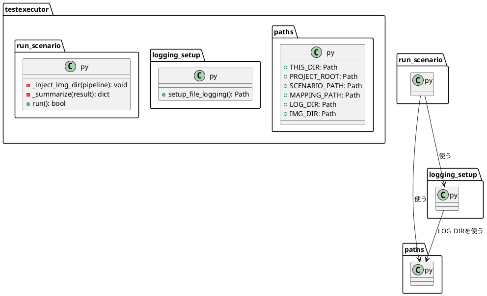

# 2026-08-29

- 位置づけ: `decisions/`（トピック別の記録）とは違い、**日付別の作業ログ**。その日にやったこと・進行中のタスクをそのまま残す。

## 今日やったこと（要約）

- `capture_pipeline_map.html`の図を実際のコードと照合し、複数箇所の描き間違いを修正
  - `run_scenario.py`を起点にする形へ修正
  - `scenario.puml → converter.py`という実在しない矢印を削除
  - `run_scenario.py → converter.py`の矢印を2本→1本に統合
- `scenario.puml`の置き場所を`normalizer/puml/`から`testexecutor/puml/`へ移動
  - `converter.py`は`scenario.puml`というファイルの存在自体を知らない（`convert()`は文字列を受け取るだけ）と判明
  - 依存の向き（testexecutor→normalizer、一方通行）に合わせ、「呼び出す側が選ぶ入力データは呼び出す側の持ち物」という原則を採用（[18](../decisions/18_scenario_puml_ownership.md)）
- `01_docs/new_adapter_package_guide.md`を「要件定義→設計・クラス図→1つずつ実装→テスト」の正式フローに改訂
- `run_scenario.py`内の「パス管理」「ログ設定」を分離するリファクタリングを計画（下記、実装は次回以降）

## 進行中のタスク：run_scenario.pyのパス管理・ログ設定の分離

新フロー（要件定義→設計・クラス図→実装→テスト）の初回練習として計画中。振る舞いは変えないリファクタリング。

### 要件定義

```text
目的：run_scenario.pyから「パス管理」「ログ設定」を分離する。動作は変えない（振る舞い保存のリファクタリング）
入力：既存のrun_scenario.pyの中身がそのまま移動するだけ、新しい入力は無い
出力：3ファイル構成（run_scenario.py / paths.py / logging_setup.py）。実行結果・保存先は今までと完全に同一
```

### 設計・クラス図



依存の向き：`run_scenario.py`が両方を使う。`logging_setup.py`も`paths.py`のLOG_DIRを必要とする。`paths.py`はどこにも依存しない一番下の存在。

### 実装箇所（未着手）

- 新規：`testexecutor/paths.py`
- 新規：`testexecutor/logging_setup.py`
- 修正：`testexecutor/run_scenario.py`（パス定義とログ設定関数を削除し、importに置き換える）

### テスト予定（未実施）

- `uv run pytest -m "not hardware" -q`（退行が無いか）
- `uv run python testexecutor/run_scenario.py`を実機で実行し、`exit code 0`・`img/`/`logs/`が今まで通り生成されるか確認
